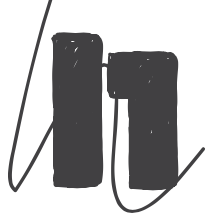

  

  

  

# Meme Machine - PC Edition

On a PC with Vulkan drivers installed, you can run this program to see a pentagram visualization of real time mind signals from your brain.

This is an active project, a work in progress and not yet stabilized.
